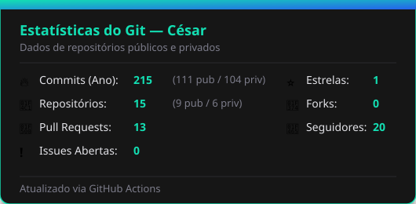
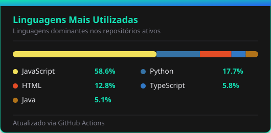
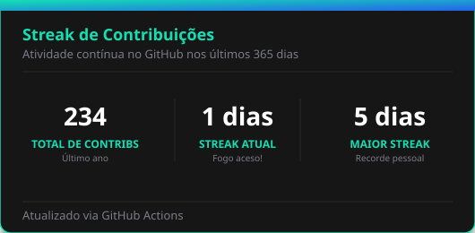

  

 

  
  

 

## 🚀 Sobre Mim

Olá! Sou o **César**, desenvolvedor apaixonado por tecnologia e acadêmico do último ano de **Ciência da Computação**. Tenho experiência prática no setor de TI desde 2023, atuando com suporte, administração de sistemas e desenvolvimento de software.

Estou sempre buscando aprimorar minhas habilidades, aprender novas tecnologias e resolver problemas reais através do código. Abaixo você pode conferir as principais ferramentas e linguagens com as quais tenho contato e experiência:

 

## 🛠️ Tecnologias e Ferramentas

### 💻 Linguagens de Programação

  
  
  
  
  
  

### 🎨 Front-end

  
  
  
  
  

### ⚙️ Back-end & Banco de Dados

  
  
  

### 🔧 Ferramentas, DevOps & Sistemas

  
  
  
  
  

### 🎬 Design & Edição

  
  

 

## 📊 Estatísticas do GitHub

  
  
    
  

 

## 🕹️ Contribuições (Estilo Pacman)

  <picture>
    <source media="(prefers-color-scheme: dark)" srcset="https://raw.githubusercontent.com/Cesarcfw/Cesarcfw/pacman-output/pacman-contribution-graph-dark.svg">
    <source media="(prefers-color-scheme: light)" srcset="https://raw.githubusercontent.com/Cesarcfw/Cesarcfw/pacman-output/pacman-contribution-graph.svg">
    
  </picture>

 
